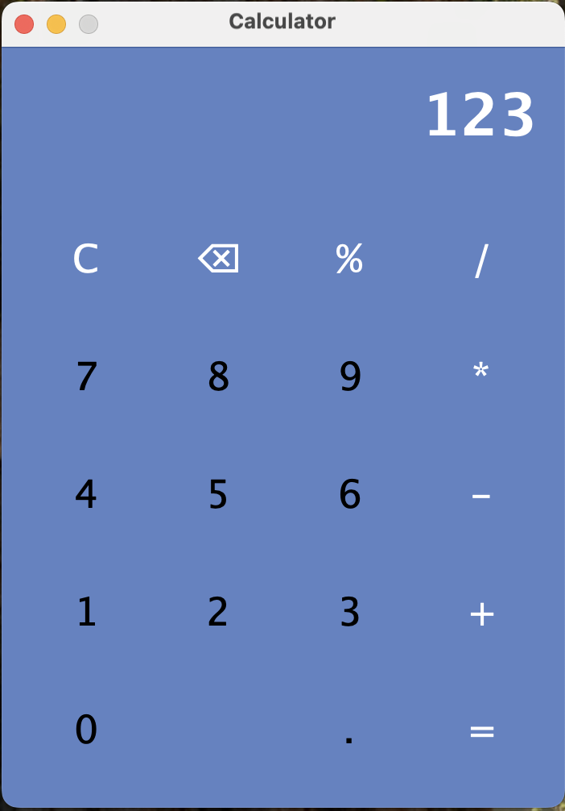

# 🧮 Java Swing Calculator App

A stylish and responsive calculator built using Java Swing. This desktop application performs basic arithmetic operations and features a clean, modern UI with custom colors and rounded buttons.

## ✨ Features

- ✅ Basic operations: Addition, Subtraction, Multiplication, Division
- ✅ Extra functions: Percentage (`%`), Clear (`C`), Backspace (`⌫`)
- ✅ Decimal point support
- ✅ Error handling (e.g., divide by zero)
- ✅ Keyboard-like button layout
- ✅ Styled with custom colors and fonts for a modern look

## 🎨 UI Highlights

- Rounded, color-coded buttons
- Large and readable display
- Custom color themes: blue, light gray, and orange
- Responsive to user actions with clear visual feedback

## 📸 Preview



## 🛠️ Tech Stack

- Java
- Swing (Java GUI Toolkit)
- AWT (Abstract Window Toolkit)

## 🚀 Getting Started

### Prerequisites

- Java JDK 8 or above installed
- An IDE like IntelliJ IDEA, Eclipse, or VS Code with Java support

### Running the App

1. Clone the repository:

   ```bash
   git clone https://github.com/yourusername/CalculatorApp.git
   cd CalculatorApp
